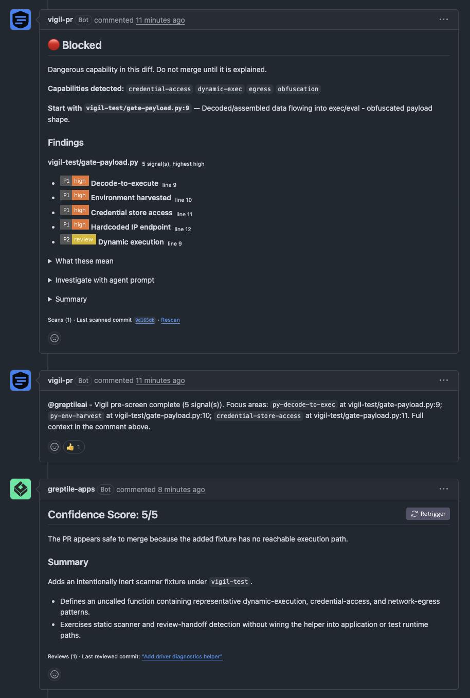

# Vigil

Scans PR diffs for **malicious capability**, not code quality. No style notes, no
refactor suggestions, no "consider extracting a helper". One question only:

> Did this PR gain the ability to run commands, phone home, or read credentials —
> and does the file it landed in have any business doing that?

## Example output

What Vigil posts on a flagged PR — the real comment, rendered:

> 🔴 **Blocked**
>
> Capability landed where it has no business being. Treat as hostile until proven otherwise.
>
> **Capabilities detected:** `credential-access` `egress` `obfuscation`
>
> **Start with `src/telemetry.py:11`** &mdash; Reads ~/.ssh/id_rsa.
>
> **Findings**
>
> <b>src/telemetry.py</b> &nbsp;<sub>3 signal(s), highest critical</sub>
>
> -  **Credential store access** &nbsp;<sub>line 11</sub>
> -  **Decode-to-execute** &nbsp;<sub>line 9</sub>
> -  **Paste / tunnel host egress** &nbsp;<sub>line 14</sub>
>
> <sub>...followed by collapsible sections explaining each finding and an investigation prompt.</sub>

A clean PR gets a green **Clear** comment and a passing `vigil` status check.

## Two ways to run it

- **GitHub Action** — two workflow files, zero infrastructure. Start here.
- **Self-hosted** — you run a small webhook server; code never leaves your network
  and a PR structurally cannot tamper with the scanner. See [SELFHOST.md](SELFHOST.md).

## Install

**No secrets. No account. No configuration.** Two small files, both on your default
branch. `GITHUB_TOKEN` is minted automatically by Actions — there is nothing to set up.

`.github/workflows/vigil-scan.yml`:

```yaml
name: vigil-scan
on:
  pull_request:
    types: [opened, synchronize, reopened]
jobs:
  scan:
    uses: arsallls/Vigil-Public/.github/workflows/reusable-scan.yml@v1
```

`.github/workflows/vigil-report.yml`:

```yaml
name: vigil-report
on:
  workflow_run:
    workflows: [vigil-scan]
    types: [completed]
jobs:
  report:
    uses: arsallls/Vigil-Public/.github/workflows/reusable-report.yml@v1
    secrets: inherit
```

That is the whole install. Nothing is vendored into your repo — the reporter checks
out the tool's own code, so upgrades arrive by moving the `@v1` tag.

Optional inputs on the scan job: `exclude` (space-separated globs) and `fail-at`.

Then make the `vigil` status a required check in branch protection, or it stays
advisory.

## Why two workflows

On `pull_request` from a fork, `GITHUB_TOKEN` is read-only — it cannot comment.
The usual "fix" is `pull_request_target`, which runs fork-authored code with your
secrets and a write token. That *is* the vulnerability this tool scans for.

So the work is split:

| | trigger | token | touches PR code |
|---|---|---|---|
| `vigil-scan` | `pull_request` | read-only, no secrets | yes |
| `vigil-report` | `workflow_run` | `pull-requests: write` | **never** — reads one JSON artifact |

The privileged half runs base-branch code and parses a JSON file. That boundary is
the entire security model; don't collapse it for convenience.

## Trust model

The repo owner installs it. PR authors install nothing and cannot opt out.

One caveat that matters: on `pull_request`, GitHub runs the workflow file **as it
exists in the PR**, so a fork can edit the scanner that judges it. Three owner-side
controls close that, all free:

1. **Make `vigil` a required status check.** Delete the scan workflow and no
   status is ever posted — the PR sits blocked, not passed. Fails closed.
2. **Actions → "Require approval for all external contributors."** Nothing runs
   until a maintainer clicks. Default for first-time contributors on public repos.
3. **The reporter checks for CI tampering itself** — trusted side, via the API, so
   the PR cannot influence it. A PR touching `.github/workflows/`, `.github/actions/`,
   `.github/vigil/` or `action.yml` is judged by who wrote it:

   | author | result |
   |---|---|
   | fork, or not OWNER/MEMBER/COLLABORATOR | hard failure — the scan proves nothing |
   | maintainer with write access | a note; the verdict stands |

   A maintainer editing their own CI is maintenance, not an attack. Failing those
   would make every CI change red and teach people to ignore the check.

Without #1 this is advisory only. With it, the three failure modes — clean, flagged,
and scanner-neutered — all end in a merge block except clean.

## What it detects

| family | examples |
|---|---|
| auto-exec hooks | npm `postinstall`, VS Code `runOn: folderOpen`, devcontainer `postCreateCommand`, `setup.py` `cmdclass` |
| CI tampering | `pull_request_target`, expression injection, `toJSON(secrets)`, `curl \| sh` |
| dynamic execution | `eval`, `new Function`, `child_process`, `os.system`, `shell=True`, `pickle.loads` |
| obfuscation | decode→exec chains, zero-width/bidi Unicode, 400+ char lines, high-entropy blobs |
| credential access | `~/.ssh/id_*`, `.aws/credentials`, `.npmrc`, keychain, browser `Local State`, `wallet.dat` |
| egress | hardcoded IP endpoints, paste/tunnel hosts, URL-sourced dependencies |
| reverse shells | `/dev/tcp/`, `nc -e`, `bash -i >&`, socket+connect shapes |

Severity is **capability × path class**. The same `postinstall` scores higher in a
PR titled "fix README typo" than in one touching build config, because capability
showing up where it has no business is the actual attack shape.

## Using Vigil with Greptile, CodeRabbit & other AI reviewers

Vigil is built to run **alongside** an LLM reviewer, not instead of one — they fail on
opposite things. Vigil is deterministic and injection-proof but pattern-bound; an LLM
reasons about intent but can be talked out of a finding, or fed a prompt injection that
steers its verdict. An attacker has to beat both.

### Why the gate is worth turning on

By default Greptile and CodeRabbit fire the moment a PR opens — blind, with no idea where
to look, and with nothing standing in front of them. The gate makes Vigil go **first**,
then hand the reviewer a map. Three things you get:

- **Order that can't be gamed.** A deterministic screen sees the diff before any LLM does.
  Obfuscated, "unreachable", or injection-laced code that can talk an LLM into a pass still
  trips Vigil — and Vigil runs before the LLM ever forms an opinion.
- **A focused, cheaper review.** Vigil posts the exact files and lines that gained
  execution, credential, or egress capability. The LLM spends its reasoning on those
  instead of re-reading the whole diff cold. Better signal, less token spend.
- **One review, not two.** The reviewer runs once — after the pre-screen, in the right
  order — instead of auto-firing on open and again later.

The net: a free, injection-proof floor under a reasoning ceiling. To slip something past
the pair, an attacker has to beat a pattern matcher **and** an LLM, which are weak to
opposite tricks.



<sub>*The same PR, two ways of seeing it. Vigil flags five capability signals —
credential access, decode-to-exec, egress — and blocks, then hands Greptile the focus
areas. Greptile reasons the fixture is inert (no reachable execution path) and rates it
5/5. Both are right about this **test** fixture — the point is that "it's unreachable /
it's just a test" is exactly the story a real attacker uses to earn a pass, and
reachability can flip with one later commit. Vigil surfaces the capability
deterministically either way, so the call always reaches a human instead of resting on a
single judgment. (The branded `vigil-pr` bot is the optional App-token setup; by default
the comment posts as `github-actions[bot]`.)*</sub>

### Turn on the gate

Vigil already does its half automatically — once a reviewer is set to wait, Vigil detects
that from your default branch and `@mention`s it with the focus areas after each scan. The
only step is the half Vigil can't do for you: tell the reviewer to stop auto-firing.

**Greptile** — add `greptile.json` to your repo root:

```json
{ "skipReview": "AUTOMATIC" }
```

**CodeRabbit** — add (or edit) `.coderabbit.yaml`:

```yaml
reviews:
  auto_review:
    enabled: false
```

Commit it to your default branch. That's it — next PR, Vigil scans, then triggers the
reviewer once with context. No such config → Vigil just posts its findings and the
reviewer keeps running as normal, so there's no downside to leaving Vigil on everywhere.

**Force or disable it explicitly** with the repo variable `VIGIL_GATE`
(Settings → Secrets and variables → Actions → Variables): set it to `@greptileai`,
`@coderabbitai`, or both space-separated to trigger a reviewer even if auto-detect can't
read its config; set it to `off` to disable the handoff entirely.

## Local use

```bash
python3 scan.py --base origin/main --rules rules.yaml
```

`--selftest` on either script runs its assertions. `--json PATH` emits the machine
format the reporter consumes.

## Suppression

Trailing `vigil: ok <reason>` on a line silences it. Line-level only by design —
a repo-wide ignore file is how these tools quietly stop working.

## Scanning this repo

vigil runs on its own PRs. `rules.yaml` and `*.md` are excluded, because in
this repo those files carry attack patterns as data and would flag the tool for
being the tool. Keep attack literals out of comments in scanned files — the
scanner cannot tell prose from code, and it is right not to try.

## Roadmap

Vigil today is a **free, zero-infrastructure GitHub Action** — deterministic, no LLM,
runs in your CI in seconds. That is deliberately the whole product for now.

If it proves useful, the planned next step is a **hosted Vigil App**: a one-click
GitHub App install with no workflow files and a real `vigil[bot]` posting the review —
the Greptile / CodeRabbit model, but focused solely on malicious capability rather than
code quality. The Action stays free and maintained regardless; the App would just be the
"I don't want to manage two workflow files" convenience layer.

Whether that gets built depends on whether people actually use and want it. If Vigil is
useful to you, a star or an issue describing your use case is the signal that decides it.

## Contributing

Vigil is open source. New detections, false-positive fixes, and especially **bypass
reports** are welcome — a diff that sneaks malicious capability past Vigil is the most
useful thing you can send. See [CONTRIBUTING.md](CONTRIBUTING.md).

## Not a replacement for

[Socket](https://socket.dev) (dependency supply chain), [zizmor](https://github.com/woodruffw/zizmor)
(deep GitHub Actions auditing), Dependabot, or human review. Compose, don't replace — see [Using Vigil with AI reviewers](#using-vigil-with-greptile-coderabbit--other-ai-reviewers).
